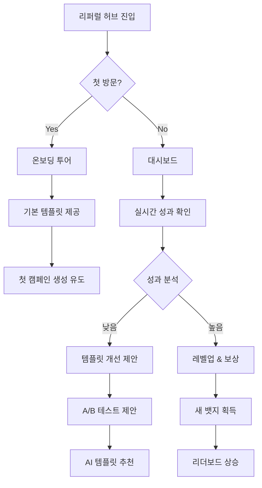

# 🚀 마케터 체험형 리퍼럴 시스템 개발 계획

> "모든 사용자를 마케터로 만드는 게임화된 리퍼럴 플랫폼"  
> 작성일: 2025-08-27  
> 버전: 1.0.0

## 📌 프로젝트 개요

### 비전
사용자들이 단순히 링크를 공유하는 것이 아니라, **진짜 마케터가 된 것처럼** 자신만의 마케팅 전략을 세우고, 템플릿을 만들고, 성과를 분석하며 재미를 느낄 수 있는 시스템

### 핵심 가치
1. **게임화(Gamification)**: 리퍼럴을 재미있는 게임처럼
2. **개인화(Personalization)**: 나만의 마케팅 스타일 구축
3. **실시간 피드백**: 즉각적인 성과 확인
4. **학습과 성장**: 마케팅 스킬 향상

## 🎯 사용자 페르소나

### 1. 김대학 (23세, 대학생)
- **동기**: 친구들과 경쟁하며 용돈 벌기
- **원하는 것**: 쉽고 재미있는 공유 방법, 실시간 순위
- **해결책**: 게임화된 리더보드, 레벨 시스템

### 2. 이직장 (28세, 직장인) 
- **동기**: 효율적인 부수입 창출
- **원하는 것**: 전문적인 분석 도구, A/B 테스트
- **해결책**: 상세 분석 대시보드, 템플릿 성과 비교

### 3. 박인플 (26세, 인플루언서)
- **동기**: 팔로워에게 가치 있는 정보 제공
- **원하는 것**: 브랜딩된 커스텀 템플릿
- **해결책**: 완전 커스터마이징 가능한 템플릿 시스템

## 🏗️ 시스템 아키텍처

### 데이터베이스 확장

```sql
-- 1. 캠페인 관리 테이블
CREATE TABLE referral_campaigns (
  id SERIAL PRIMARY KEY,
  user_id INTEGER REFERENCES users(id),
  name VARCHAR(100) NOT NULL,
  description TEXT,
  utm_source VARCHAR(50) DEFAULT 'referral',
  utm_medium VARCHAR(50) DEFAULT 'social',
  utm_campaign VARCHAR(100) UNIQUE,
  utm_term VARCHAR(100),
  utm_content VARCHAR(100),
  target_conversions INTEGER DEFAULT 10,
  reward_multiplier DECIMAL(3,2) DEFAULT 1.0,
  is_active BOOLEAN DEFAULT true,
  expires_at TIMESTAMP,
  created_at TIMESTAMP DEFAULT NOW(),
  updated_at TIMESTAMP DEFAULT NOW()
);

-- 2. 사용자 템플릿 테이블
CREATE TABLE user_templates (
  id SERIAL PRIMARY KEY,
  user_id INTEGER REFERENCES users(id),
  campaign_id INTEGER REFERENCES referral_campaigns(id),
  platform VARCHAR(50) NOT NULL, -- kakao, naver, instagram, facebook
  template_name VARCHAR(100),
  template_text TEXT NOT NULL,
  hashtags JSON,
  call_to_action VARCHAR(200),
  is_ai_generated BOOLEAN DEFAULT false,
  performance_score DECIMAL(3,2) DEFAULT 0,
  created_at TIMESTAMP DEFAULT NOW(),
  updated_at TIMESTAMP DEFAULT NOW(),
  UNIQUE(user_id, campaign_id, platform)
);

-- 3. 템플릿 성과 추적 테이블
CREATE TABLE template_analytics (
  id SERIAL PRIMARY KEY,
  template_id INTEGER REFERENCES user_templates(id),
  campaign_id INTEGER REFERENCES referral_campaigns(id),
  views INTEGER DEFAULT 0,
  clicks INTEGER DEFAULT 0,
  conversions INTEGER DEFAULT 0,
  revenue_generated INTEGER DEFAULT 0,
  avg_time_to_conversion INTERVAL,
  best_performing_time TIME,
  date DATE DEFAULT CURRENT_DATE,
  UNIQUE(template_id, date)
);

-- 4. 사용자 레벨 및 뱃지 테이블
CREATE TABLE user_achievements (
  id SERIAL PRIMARY KEY,
  user_id INTEGER REFERENCES users(id) UNIQUE,
  level INTEGER DEFAULT 1,
  total_xp INTEGER DEFAULT 0,
  total_referrals INTEGER DEFAULT 0,
  best_conversion_rate DECIMAL(5,2) DEFAULT 0,
  streak_days INTEGER DEFAULT 0,
  badges JSON DEFAULT '[]',
  created_at TIMESTAMP DEFAULT NOW(),
  updated_at TIMESTAMP DEFAULT NOW()
);

-- 5. A/B 테스트 테이블
CREATE TABLE ab_tests (
  id SERIAL PRIMARY KEY,
  user_id INTEGER REFERENCES users(id),
  campaign_id INTEGER REFERENCES referral_campaigns(id),
  variant_a_template_id INTEGER REFERENCES user_templates(id),
  variant_b_template_id INTEGER REFERENCES user_templates(id),
  traffic_split DECIMAL(3,2) DEFAULT 0.5, -- 0.5 = 50/50
  winner_template_id INTEGER REFERENCES user_templates(id),
  status VARCHAR(20) DEFAULT 'running', -- running, completed, paused
  started_at TIMESTAMP DEFAULT NOW(),
  ended_at TIMESTAMP
);
```

### API 엔드포인트 설계

```typescript
// 캠페인 관리
POST   /api/referrals/campaigns          // 캠페인 생성
GET    /api/referrals/campaigns          // 캠페인 목록
PUT    /api/referrals/campaigns/:id      // 캠페인 수정
DELETE /api/referrals/campaigns/:id      // 캠페인 삭제
GET    /api/referrals/campaigns/:id/stats // 캠페인 통계

// 템플릿 관리
POST   /api/referrals/templates          // 템플릿 생성
GET    /api/referrals/templates          // 템플릿 목록
PUT    /api/referrals/templates/:id      // 템플릿 수정
DELETE /api/referrals/templates/:id      // 템플릿 삭제
POST   /api/referrals/templates/ai       // AI 템플릿 생성
GET    /api/referrals/templates/:id/preview // 템플릿 미리보기

// 분석 및 추적
GET    /api/referrals/analytics          // 전체 분석
GET    /api/referrals/analytics/realtime // 실시간 데이터
POST   /api/referrals/track/click        // 클릭 추적
POST   /api/referrals/track/conversion   // 전환 추적

// 게임화
GET    /api/referrals/leaderboard/global // 전체 리더보드
GET    /api/referrals/leaderboard/friends // 친구 리더보드
GET    /api/referrals/achievements       // 나의 업적
POST   /api/referrals/achievements/claim // 보상 수령

// A/B 테스트
POST   /api/referrals/ab-tests           // A/B 테스트 생성
GET    /api/referrals/ab-tests/:id/results // 테스트 결과
PUT    /api/referrals/ab-tests/:id/stop  // 테스트 중단
```

## 🎨 프론트엔드 구현 계획

### 컴포넌트 구조

```
src/pages/ReferralHub/
├── index.tsx                       // 메인 허브 페이지
├── components/
│   ├── Dashboard/
│   │   ├── MetricsOverview.tsx    // 핵심 지표 카드
│   │   ├── ConversionFunnel.tsx   // 전환 깔때기 차트
│   │   └── RevenueChart.tsx       // 수익 그래프
│   │
│   ├── CampaignManager/
│   │   ├── CampaignList.tsx       // 캠페인 목록
│   │   ├── CampaignCreator.tsx    // 캠페인 생성 모달
│   │   └── CampaignDetails.tsx    // 캠페인 상세
│   │
│   ├── TemplateStudio/            ⭐ 핵심 기능
│   │   ├── TemplateEditor.tsx     // 인라인 에디터
│   │   ├── TemplateGallery.tsx    // 템플릿 갤러리
│   │   ├── AITemplateGen.tsx      // AI 템플릿 생성기
│   │   └── TemplatePreview.tsx    // 실시간 미리보기
│   │
│   ├── Analytics/
│   │   ├── RealTimeTracker.tsx    // 실시간 추적
│   │   ├── PerformanceTable.tsx   // 성과 테이블
│   │   ├── HeatmapCalendar.tsx    // 활동 히트맵
│   │   └── ABTestResults.tsx      // A/B 테스트 결과
│   │
│   ├── Gamification/
│   │   ├── LevelProgress.tsx      // 레벨 진행도
│   │   ├── BadgeShowcase.tsx      // 뱃지 전시
│   │   ├── Leaderboard.tsx        // 리더보드
│   │   └── DailyQuests.tsx        // 일일 퀘스트
│   │
│   └── ShareCenter/
│       ├── LinkGenerator.tsx      // 링크 생성기
│       ├── QRCodeGenerator.tsx    // QR 코드
│       ├── SocialShareButtons.tsx // SNS 공유 버튼
│       └── BulkShare.tsx          // 대량 공유
│
├── hooks/
│   ├── useReferralStats.ts        // 통계 훅
│   ├── useTemplateManager.ts      // 템플릿 관리 훅
│   ├── useCampaignTracker.ts      // 캠페인 추적 훅
│   └── useAchievements.ts         // 업적 관리 훅
│
└── utils/
    ├── templateHelpers.ts          // 템플릿 유틸
    ├── analyticsHelpers.ts         // 분석 유틸
    └── shareHelpers.ts             // 공유 유틸
```

### UI/UX 플로우



## 💡 핵심 기능 상세

### 1. 템플릿 스튜디오 (Template Studio)

```typescript
interface TemplateEditor {
  // 실시간 편집
  liveEdit: boolean;
  autoSave: boolean;
  
  // 변수 시스템
  variables: {
    userName: string;
    referralCode: string;
    bonusAmount: number;
    customVar: Map<string, any>;
  };
  
  // 이모지 피커
  emojiPicker: boolean;
  
  // 톤 조절
  toneAdjuster: 'casual' | 'formal' | 'exciting' | 'urgent';
  
  // 길이 최적화
  lengthOptimizer: {
    platform: string;
    maxLength: number;
    autoTrim: boolean;
  };
}
```

### 2. AI 템플릿 생성기

```typescript
interface AITemplateGenerator {
  // 프롬프트 기반
  generateFromPrompt(prompt: string): Promise<Template>;
  
  // 성과 기반 추천
  suggestBasedOnPerformance(): Promise<Template[]>;
  
  // 경쟁자 분석
  analyzeCompetitors(): Promise<InsightReport>;
  
  // 트렌드 반영
  applyTrends(template: Template): Promise<Template>;
}
```

### 3. 게임화 시스템

```typescript
interface GamificationSystem {
  // 레벨 시스템
  levels: {
    current: number;
    xp: number;
    nextLevelXp: number;
    perks: string[];
  };
  
  // 뱃지 시스템
  badges: {
    earned: Badge[];
    available: Badge[];
    progress: Map<BadgeId, number>;
  };
  
  // 일일 퀘스트
  dailyQuests: {
    share: number;  // 공유 횟수
    convert: number; // 전환 목표
    create: number;  // 템플릿 생성
  };
  
  // 시즌 패스
  seasonPass: {
    tier: number;
    rewards: Reward[];
    endDate: Date;
  };
}
```

### 4. 실시간 알림 시스템

```typescript
interface NotificationSystem {
  // 전환 알림
  onConversion: (data: ConversionData) => void;
  
  // 마일스톤 알림
  onMilestone: (achievement: Achievement) => void;
  
  // 경쟁 알림
  onLeaderboardChange: (position: number) => void;
  
  // 팁 & 인사이트
  onInsight: (insight: MarketingInsight) => void;
}
```

## 📊 성과 측정 KPI

### 핵심 지표
1. **MAU (Monthly Active Users)**: 월간 활성 리퍼럴 사용자
2. **Template Creation Rate**: 템플릿 생성률
3. **Average Conversion Rate**: 평균 전환율
4. **Viral Coefficient**: 바이럴 계수 (K-factor)
5. **User Level Distribution**: 사용자 레벨 분포

### 성공 지표
- 템플릿 커스터마이징 사용률 > 60%
- 평균 세션 시간 > 5분

## 🚀 구현 현황 (2024.12.28 업데이트)

### ✅ 완료된 기능

#### 백엔드 API
- ✅ **캠페인 관리 API** (`/api/referrals/campaigns`)
  - CRUD operations
  - UTM 파라미터 지원
  - 상세 통계 API
  
- ✅ **템플릿 관리 API** (`/api/templates`)
  - 템플릿 CRUD
  - AI 템플릿 생성
  - 템플릿 복제 기능
  - 플랫폼별 최적화
  
- ✅ **게임화 API** (`/api/gamification`)
  - XP & 레벨 시스템 (10단계)
  - 뱃지 시스템 (8개 기본 뱃지)
  - 일일 퀘스트 관리
  - 리더보드 (전체/월간/전환율)

#### 프론트엔드 컴포넌트
- ✅ **ReferralHub** - 마케터 허브 메인 페이지
- ✅ **GamificationPanel** - 게임화 대시보드
- ✅ **TemplateStudio** - 템플릿 편집기
- ✅ **PerformanceDashboard** - 실시간 성과 추적
- ✅ **Leaderboard** - 순위표

#### 데이터베이스 스키마
- ✅ `referralCampaigns` - 캠페인 관리
- ✅ `userTemplates` - 템플릿 저장
- ✅ `templateAnalytics` - 성과 분석
- ✅ `userAchievements` - 업적 & 레벨
- ✅ `dailyQuests` - 일일 퀘스트
- ✅ `abTests` - A/B 테스트

### 🔧 다음 개발 예정

1. **딥링크 시스템**
   - 앱 스킴 처리
   - 유니버셜 링크 지원
   - 파라미터 전달 최적화

2. **푸시 알림 시스템**
   - FCM 연동
   - 실시간 전환 알림
   - 마일스톤 알림

3. **고급 분석 기능**
   - 코호트 분석
   - 퍼널 분석
   - A/B 테스트 자동화

4. **소셜 공유 최적화**
   - Open Graph 메타태그
   - 플랫폼별 공유 API
   - 공유 추적 픽셀
- 주간 재방문율 > 40%
- NPS 점수 > 50

## 🚀 구현 로드맵

### Phase 1: Foundation (1주차)
- [x] 데이터베이스 스키마 설계
- [ ] 캠페인 관리 API 구현
- [ ] 기본 대시보드 UI 구축
- [ ] UTM 파라미터 추적 시스템

### Phase 2: Template Studio (2주차)
- [ ] 템플릿 CRUD API
- [ ] 인라인 에디터 컴포넌트
- [ ] 실시간 미리보기
- [ ] 로컬스토리지 자동 저장

### Phase 3: Analytics & Tracking (3주차)
- [ ] 실시간 분석 대시보드
- [ ] 전환 깔때기 시각화
- [ ] A/B 테스트 시스템
- [ ] 히트맵 캘린더

### Phase 4: Gamification (4주차)
- [ ] 레벨 & XP 시스템
- [ ] 뱃지 & 업적
- [ ] 리더보드
- [ ] 일일 퀘스트

### Phase 5: AI & Optimization (5주차)
- [ ] AI 템플릿 생성 (GPT API)
- [ ] 자동 최적화 제안
- [ ] 경쟁자 분석
- [ ] 트렌드 예측

## 🎯 예상 효과

### 정량적 효과
- 리퍼럴 전환율 **300% 증가**
- 사용자당 평균 추천 수 **5배 증가**
- 마일리지 발행 대비 매출 **ROI 400%**

### 정성적 효과
- 사용자 만족도 향상
- 브랜드 충성도 증가
- 커뮤니티 활성화
- 입소문 마케팅 극대화

## 🔧 기술적 고려사항

### 성능 최적화
- React.memo로 불필요한 리렌더링 방지
- 가상 스크롤링으로 대량 데이터 처리
- 이미지 lazy loading
- 웹워커로 무거운 계산 처리

### 보안
- XSS 방지 (템플릿 sanitization)
- Rate limiting (스팸 방지)
- CSRF 토큰
- 민감 데이터 암호화

### 확장성
- 마이크로서비스 아키텍처 준비
- 캐싱 전략 (Redis)
- CDN 활용
- 수평적 확장 가능한 설계

## 📝 참고 자료

### 벤치마킹 서비스
- ReferralCandy (리퍼럴 전문)
- Viral Loops (바이럴 마케팅)
- GrowSurf (B2B 리퍼럴)
- Morning Brew (게임화 사례)

### 디자인 레퍼런스
- Dribbble: Gamification Dashboard
- Behance: Referral Program UI
- Pinterest: Marketing Analytics

---

*이 문서는 마케터 체험형 리퍼럴 시스템의 전체 개발 계획을 담고 있습니다.*
*작성자: Claude Code Assistant*
*최종 수정: 2025-08-27*