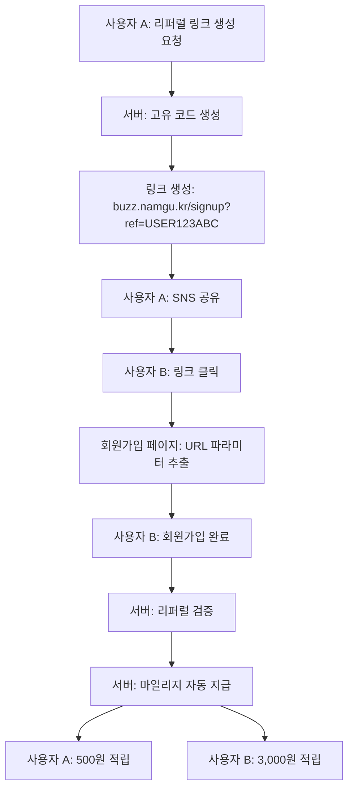

# 🔄 Buzz 리퍼럴 시스템 완전 가이드

> 핵심 비즈니스 로직 상세 문서  
> 최종 업데이트: 2025-08-27

## 📌 시스템 개요

### 목적
- **바이럴 마케팅**: 사용자가 자발적으로 서비스를 홍보
- **사용자 획득**: 기존 사용자를 통한 신규 사용자 유입
- **지역 경제 활성화**: 대학생 → 관광객 → 지역 상권 선순환

### 핵심 지표
- **추천인 보상**: 500원 마일리지
- **피추천인 보상**: 3,000원 가입 보너스
- **일반 가입 보너스**: 1,000원

## 🔄 전체 플로우



## 💻 구현 상세

### 1. 리퍼럴 코드 생성 로직
**위치**: `packages/api/src/routes/auth.ts:52-72`

```typescript
// 고유 리퍼럴 코드 생성
const generateReferralCode = (name: string): string => {
  const randomPart = uuidv4().substring(0, 6).toUpperCase();
  const namePrefix = name.substring(0, 2).toUpperCase().replace(/[^A-Z]/g, 'BZ');
  return namePrefix + randomPart;
};

// 예시: 김철수 → KI3A5B7C
```

### 2. 리퍼럴 링크 생성 API
**위치**: `packages/api/src/routes/referral.ts:32-72`

**엔드포인트**: `POST /api/referrals/link`

```typescript
// 요청
POST /api/referrals/link
Headers: Cookie: buzz.sid=xxxxx

// 응답
{
  "success": true,
  "data": {
    "referralLink": "https://buzz.namgu.kr/signup?ref=KI3A5B7C",
    "referralCode": "KI3A5B7C",
    "shareMessage": "🍴 부산 남구 맛집을 발견하고...",
    "userName": "김철수"
  }
}
```

### 3. URL 파라미터 처리 (Frontend)
**위치**: `apps/buzz/src/pages/SignupPage.tsx:37-56`

```typescript
// URL에서 리퍼럴 코드 자동 추출
const SignupPage = () => {
  const search = useSearch();
  const referralCodeFromURL = new URLSearchParams(search).get('ref');
  
  useEffect(() => {
    if (referralCodeFromURL) {
      form.setValue('referralCode', referralCodeFromURL);
      // TODO: localStorage 저장 추가 필요
      // localStorage.setItem('pendingReferralCode', referralCodeFromURL);
    }
  }, [referralCodeFromURL]);
};
```

### 4. 회원가입 시 리퍼럴 처리
**위치**: `packages/api/src/routes/auth.ts:166-256`

```typescript
// 리퍼럴 처리 로직
if (referralCode && referralEnabled) {
  // 1. 추천인 조회
  const referrer = await tx.select()
    .from(users)
    .where(eq(users.referralCode, referralCode))
    .limit(1);
  
  if (referrer.length > 0) {
    // 2. 리퍼럴 관계 저장
    await tx.insert(referrals).values({
      referrerId: referrer[0].id,
      refereeId: newUser.id,
      referralCode,
      rewardAmount: 500,
      signupBonus: 3000,
      status: 'completed'
    });
    
    // 3. 추천인 마일리지 지급
    await tx.update(users)
      .set({ mileageBalance: referrer[0].mileageBalance + 500 })
      .where(eq(users.id, referrerId));
    
    // 4. 피추천인 마일리지 지급
    await tx.update(users)
      .set({ mileageBalance: 3000 })
      .where(eq(users.id, newUser.id));
    
    // 5. 거래 내역 기록
    // ... mileageTransactions 테이블에 기록
  }
}
```

### 5. SNS 공유 템플릿
**위치**: `packages/api/src/routes/referral.ts:241-353`

```typescript
// 플랫폼별 최적화된 메시지
const templates = {
  kakao: {
    message: "친구야! 부산 남구 맛집 앱 한번 써봐~",
    hashtags: ['부산맛집', '남구맛집', '마일리지'],
  },
  instagram: {
    message: "🍴✨ 부산 남구 맛집 투어 with Buzz",
    hashtags: ['맛스타그램', '부산여행'],
  }
  // ...
};
```

## 📊 리퍼럴 성과 추적

### 통계 API
**엔드포인트**: `GET /api/referrals/stats`

```typescript
// 응답 데이터
{
  "totalReferred": 25,        // 총 추천 인원
  "totalEarned": 12500,       // 총 획득 마일리지
  "thisMonthReferred": 8,     // 이번 달 추천
  "thisMonthEarned": 4000,    // 이번 달 획득
  "recentReferrals": [...]    // 최근 추천 목록
}
```

### 리더보드
**엔드포인트**: `GET /api/referrals/leaderboard`

```typescript
// 이번 달 TOP 추천인
[
  { rank: 1, userName: "김***", referralCount: 25, totalEarned: 12500 },
  { rank: 2, userName: "이***", referralCount: 18, totalEarned: 9000 }
]
```

## 🔐 보안 요구사항

### ✅ 구현된 보안
- 리퍼럴 코드 유일성 보장
- 추천 관계 검증
- 마일리지 트랜잭션 원자성

### ❌ 미구현 보안 (긴급)

#### 1. 자기 자신 추천 방지
```typescript
// auth.ts:168에 추가 필요
if (referralCode === newUser.referralCode) {
  throw new Error('자기 자신을 추천할 수 없습니다');
}
```

#### 2. 중복 가입 방지
```typescript
// IP 기반 체크 추가 필요
const clientIp = req.ip || req.connection.remoteAddress;
const existingFromIP = await tx.select()
  .from(users)
  .where(eq(users.signup_ip, clientIp))
  .where(gte(users.createdAt, new Date(Date.now() - 24*60*60*1000)));

if (existingFromIP.length >= 3) {
  throw new Error('동일 IP에서 24시간 내 가입 제한 초과');
}
```

#### 3. 추천 한도 제한
```typescript
// 24시간 내 추천 한도 체크
const recentReferrals = await tx.select()
  .from(referrals)
  .where(and(
    eq(referrals.referrerId, referrerId),
    gte(referrals.createdAt, new Date(Date.now() - 24*60*60*1000))
  ));

if (recentReferrals.length >= 5) {
  throw new Error('24시간 내 추천 한도(5명) 초과');
}
```

#### 4. 리퍼럴 코드 유효기간
```sql
-- 테이블 수정 필요
ALTER TABLE users ADD COLUMN referral_expires_at TIMESTAMP;
-- 30일 후 만료 설정
UPDATE users SET referral_expires_at = NOW() + INTERVAL '30 days';
```

## 🔧 localStorage 구현 (필요)

### 현재 문제점
- 페이지 새로고침 시 리퍼럴 코드 유실
- 회원가입 중 이탈 후 재진입 시 코드 없음

### 해결 방안
```typescript
// SignupPage.tsx에 추가
useEffect(() => {
  // URL 파라미터 체크
  const urlCode = new URLSearchParams(search).get('ref');
  
  if (urlCode) {
    localStorage.setItem('pendingReferralCode', urlCode);
    form.setValue('referralCode', urlCode);
  } else {
    // URL에 없으면 localStorage 체크
    const storedCode = localStorage.getItem('pendingReferralCode');
    if (storedCode) {
      form.setValue('referralCode', storedCode);
    }
  }
}, [search]);

// 회원가입 성공 시 제거
const onSignupSuccess = () => {
  localStorage.removeItem('pendingReferralCode');
  // ...
};
```

## 📱 모바일 딥링크 (미구현)

### 구현 필요 사항
```javascript
// 앱 스킴 등록
buzz://signup?ref=USER123ABC

// 딥링크 처리
const handleDeepLink = (url) => {
  if (url.includes('signup')) {
    const ref = extractParam(url, 'ref');
    navigateToSignup({ referralCode: ref });
  }
};
```

## 🎯 비즈니스 규칙

### 마일리지 정책
| 상황 | 추천인 | 피추천인 |
|------|--------|----------|
| 일반 가입 | - | 1,000원 |
| 리퍼럴 가입 | 500원 | 3,000원 |
| 이벤트 기간 | 1,000원 | 5,000원 |

### 제한 사항
- 자기 추천 불가
- 24시간 내 동일 추천인 5명 제한
- 동일 IP 24시간 내 3개 계정 제한
- 리퍼럴 코드 30일 유효

## 📈 성과 측정

### KPI (Key Performance Indicators)
- **리퍼럴 전환율**: 링크 클릭 → 가입 완료
- **바이럴 계수**: 사용자당 평균 추천 수
- **LTV 증가**: 리퍼럴 사용자 vs 일반 사용자
- **CAC 감소**: 리퍼럴을 통한 획득 비용 절감

### 추적 필요 데이터
```sql
-- 리퍼럴 성과 분석 쿼리
SELECT 
  DATE_TRUNC('day', created_at) as date,
  COUNT(*) as referral_count,
  SUM(reward_amount) as total_rewards,
  AVG(signup_bonus) as avg_bonus
FROM referrals
WHERE created_at >= NOW() - INTERVAL '30 days'
GROUP BY DATE_TRUNC('day', created_at)
ORDER BY date DESC;
```

## 🧪 테스트 시나리오

### 1. 정상 플로우
1. 사용자 A 로그인
2. 리퍼럴 링크 생성
3. 사용자 B가 링크 클릭
4. 회원가입 완료
5. 양쪽 마일리지 확인

### 2. 예외 케이스
- ❌ 자기 자신 추천 시도
- ❌ 만료된 코드 사용
- ❌ 존재하지 않는 코드
- ❌ 중복 가입 시도

### 3. 보안 테스트
- ❌ SQL Injection
- ❌ XSS 공격
- ❌ CSRF 공격
- ❌ Rate Limiting

## 🚀 개선 제안

### 단기 (1주일)
1. 자기 추천 방지 구현
2. localStorage 저장 구현
3. IP 기반 중복 체크

### 중기 (1개월)
1. 리퍼럴 코드 유효기간
2. 추천 한도 제한
3. 비정상 패턴 감지

### 장기 (3개월)
1. A/B 테스트 시스템
2. 다단계 리퍼럴 보상
3. 리퍼럴 캠페인 관리

## 📚 관련 문서

- [API 문서](../api/referral-api.md)
- [보안 체크리스트](../security/referral-security.md)
- [데이터베이스 스키마](../database/schema-guide.md)

---

*이 문서는 리퍼럴 시스템의 모든 측면을 다루고 있으며, 개발 진행에 따라 업데이트됩니다.*